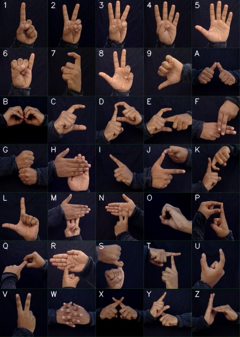

# Indian-sign-language-recognition

Hello, This repository contains python implementation for recognising Indian sign language (ISL) gestures. As there is less research, there is no standard dataset avialable in the web. So, we decided to create my own [dataset](https://drive.google.com/open?id=1keWr7-X8aR4YMotY2m8SlEHlyruDDdVi) of gesture images. ISL dataset have all alphabets (A-Z) and numerics (1-9) with total classes = 35. Each class has 1200 images. ISL gestures are practically hard to recognise as two hands are involved and because of complexity. To classify images, Bag-of-words (bow) model has been implemented with SVM. **70:30** ratio has been used for train and test to split. Using this method, the model gives 99% accuracy approximatly with very less error rate. 

## Gestures

All the gestures used in the dataset are in the shown below image with labels.

## Implementation

The implementation follows several steps:

i) Image segmentation (masking to get raw skin and edges in the image)  
ii) SIFT Feature detection (finding feature descriptors for all data)  
iii) K-means clustering (Codebook generation: to cluster all features and to get visual words (bow))  
iv) Histograms computation (Using visual words (bow) compute histograms for each image)  
v) SVM model for classification (input: histograms, output: predection for testdata)  

## Run files

Run files in order: 
**Step 1:** (Optional) To create your own Dataset run

>   python image_capture.py

**Step 2:** If you want to use our dataset download from below and extract it in the root directory of the repository.  Then run

>   python imagePreprocessing.py

to preprocess all the images (from raw images to histograms of bovw model) and to classify using SVM.

**Step 3:** To visualise the confusion matrix run the file

>   python visualise.py

Dataset can be downloaded from : https://drive.google.com/open?id=1keWr7-X8aR4YMotY2m8SlEHlyruDDdVi

### Credits

- Inspired by the [implementation of Rishab Guptha](https://github.com/imRishabhGupta/Indian-Sign-Language-Recognition)
- Bag of features model post by [kaggle](https://www.kaggle.com/pierre54/bag-of-words-model-with-sift-descriptors)
- Implementing Bag of Visual words for Object Recognition [post](https://kushalvyas.github.io/BOV.html)
- Bag of Visual Words(BoVW) by Aybüke Yalçıner [post](https://medium.com/@aybukeyalcinerr/bag-of-visual-words-bovw-db9500331b2f)

